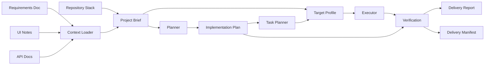

# Architecture

DevFlow is designed as a local-first CLI with replaceable workflow stages.

## High-Level Flow



The current MVP implements the context loader, repository stack detector, structured project brief writer, planner, plan writer, task planner, stack-specific target profiler, bounded source-context sampler, dry-run executor, patch-set applicator, verification report writer, delivery report writer, and machine-readable delivery manifest writer. Source-changing execution is constrained to validated patch sets and explicit delivery confirmation.

## Modules

- CLI: command routing and terminal output, including local delivery status summaries from the manifest.
- Config: local `.devflow/config.json` loading and defaults.
- Context: reads requirements, UI notes, and API docs.
- Design Assets And Tokens: extracts UI Markdown image references into the project brief, including local path existence, SVG structure/text/color metadata, PNG/JPEG dimensions, and structured visual tokens for color, typography, spacing, radius, shadows, motion, and iconography.
- API Contracts: extracts recognizable HTTP method/path endpoint references, inline query/path parameters, GraphQL operations, fenced JSON data model summaries, OpenAPI JSON/YAML structures including parameters, API error cases, and auth requirements into the project brief.
- Stack Detector: detects package manager, runtime, frontend frameworks, build tools, styling, testing, scripts, source directories, and config files from dependency metadata plus common frontend conventions such as Next.js, Vue, Nuxt, Svelte, Angular, Astro, Tailwind, Vitest, Playwright, Cypress, and Jest config files.
- Brief: combines documents and repository signals into `.devflow/artifacts/project-brief.json`, including normalized route/view, explicit route path, component name, data-need, and UI-state targets for downstream planning.
- AI Provider: calls OpenAI-compatible chat completions for planning and dry-run execution when configured.
- Prompt Artifacts: optionally writes exact planner, dry-run, and patch-set prompts to local files for review before or during AI usage.
- Planner: builds prompts from the project brief, invokes AI or deterministic fallback, and formats output with a frontend delivery blueprint for routes, components, state, data/API integration, styling/responsive rules, tests, and accessibility. Provider plans are guarded so patch-set JSON responses fall back to the local planner and provider plans missing the blueprint receive a generated blueprint appendix.
- Task Planner: writes `.devflow/artifacts/tasks.json` and `.devflow/artifacts/tasks.md`, including normalized frontend targets and structured implementation units derived from explicit route/view targets, component targets, frontend data needs, frontend state targets, user stories, acceptance criteria, requirement constraints, requirements, UI, design assets, design tokens, API endpoints, data models, error cases, and auth requirements. Generated implementation units include dependency hints and type-specific review checklists for focused handoff and dry-run review.
- Target Profile: derives normalized frontend target summaries plus stack-specific component, data, style, test, config, verification, and explicit route/component/API file candidates from the project brief and selected implementation unit. When a normalized frontend route, component, or data unit is selected, its route path, component name, or endpoint text is prioritized ahead of broader brief-level candidates, including Nuxt, Svelte/SvelteKit, Astro, and Angular-aware route, data, style, and test candidates.
- Source Context: samples a bounded set of existing repository files, directories, and missing/glob candidates from the target profile so AI prompts can see local source conventions without reading the whole repository. When a selected implementation unit is present, sampling follows the unit's route/component/data priority before broader profile candidates so the most relevant source context is less likely to be pushed out by entry limits. AI execution writes `.devflow/artifacts/source-context-summary.json` with path-level sampling evidence for reports and manifests without duplicating sampled source snippets.
- Executor: supports `execute --dry-run`, writing AI-assisted or deterministic patch proposal documents without changing source files. Dry-run proposals surface UI checklist coverage and delivery risks, and dry-run and patch-set prompts include the target profile and, unless disabled with `--no-source-context` or `DEVFLOW_SOURCE_CONTEXT=none`, sampled source context so AI execution is grounded in likely repository files and existing code.
- Patch Applicator: supports `execute --validate` for non-mutating patch-set checks and `execute --apply` for source-changing execution. It validates strict JSON patch sets, enforces patch-set operation and payload limits, writes/replaces/deletes files only during apply, restores the apply backup automatically if a partial apply fails, and records `.devflow/artifacts/execution-log.json` plus `.devflow/artifacts/task-changelog.md` with operation status, bytes written, replacements, line-count deltas, reviewer notes, and links to verification and delivery artifacts after successful applies.
- Patch Set Schema: publishes `schemas/patch-set.schema.json` so external AI agents, editors, and CI jobs can align with DevFlow's patch-set contract before runtime validation.
- Delivery Manifest Schema: publishes `schemas/delivery-manifest.schema.json` so external tools can validate delivery artifact indexes and evidence summaries without scraping Markdown.
- Delivery Orchestrator: supports safe `deliver` dry-runs and explicit `deliver --apply --yes` source-changing delivery before verification and report generation.
- Rollback: restores files from `.devflow/artifacts/backups/<id>/manifest.json`, writes `.devflow/artifacts/rollback-report.json`, and is invoked automatically when source-changing apply fails after backup creation.
- Verification: runs recommended project commands detected from `check`, `lint`, `typecheck`, `test`, and `build` package scripts, common script aliases, or inferred TypeScript, test, and build tooling, then writes `.devflow/artifacts/verification-report.json`, including bounded stdout/stderr excerpts for failed commands.
- Visual Verification: captures desktop, tablet, and mobile screenshots, blank-screen analysis, layout issue checks for overflow, clipped text, and overlapping visible elements, plus text checks for preview URLs into `.devflow/artifacts/visual/visual-report.json`. Delivery runs can infer default text checks from design asset text snippets and UI state labels when no explicit visual text is provided.
- Report: writes `.devflow/artifacts/delivery-report.md` for reviewers and `.devflow/artifacts/delivery-manifest.json` for tools. These summarize source documents, acceptance criteria, stack, design tokens, artifact paths and statuses, prompt artifact directory status, source-context sampling summaries, touched files, applied patch sets, task changelogs, backup manifests, line-count deltas, verification with bounded failure excerpts, visual evidence with embedded screenshots when available, risk assessment, delivery readiness, open questions, and next actions.
- Status: reads `.devflow/artifacts/delivery-manifest.json` and prints either a compact delivery summary or raw manifest JSON, with source-context sampling evidence and optional CI gate exits for readiness attention and failed verification.
- Doctor: checks runtime and project readiness.
- GitHub Action: wraps safe `dev-flow deliver` for CI usage, requires explicit double confirmation for source-changing delivery, can upload artifacts and job summaries with `always()`, and can fail CI from manifest-backed readiness or failed-verification gates.

## Configuration

DevFlow stores project-level configuration in `.devflow/config.json`:

```json
{
  "requirementsPath": "docs/requirements.md",
  "uiPath": "docs/ui.md",
  "apiPath": "docs/api.md",
  "artifactsDir": ".devflow/artifacts"
}
```

## Project Brief

`dev-flow brief` writes `.devflow/artifacts/project-brief.json`. This file is the machine-readable handoff between context gathering and planning.

The brief contains:

- Source document paths.
- Extracted requirement, UI, and API signals.
- User stories, requirement constraints, and acceptance criteria extracted from requirements.
- UI design assets referenced from Markdown image links, including local existence checks, SVG width, height, viewBox, title, description, color swatches, and text snippets, plus PNG/JPEG dimensions when available.
- UI design tokens extracted from visual token notes for color, typography, spacing, radius, shadows, motion, and iconography.
- API endpoint contracts extracted from HTTP method/path references and GraphQL operations, with inline query/path parameters and OpenAPI query, path, header, and cookie parameters when available.
- API data models extracted from fenced `json` examples.
- API error cases and authentication requirements extracted from API docs.
- OpenAPI JSON/YAML paths, parameters, component schemas, request/response schemas, error responses, and security requirements extracted from fenced blocks.
- Delivery risks scored from ambiguous requirements, missing UI/API detail, missing verification commands, and unresolved project gates.
- Open questions.
- Repository stack profile.
- Recommended verification commands.

`dev-flow plan` also writes the brief before generating the implementation plan so downstream tools can rely on the same context.

## AI Provider Contract

The first provider uses an OpenAI-compatible `/chat/completions` API:

- `DEVFLOW_AI_API_KEY`
- `OPENAI_API_KEY`
- `DEVFLOW_AI_BASE_URL`
- `DEVFLOW_AI_MODEL`
- `DEVFLOW_AI_FIXTURE_PATH`

The provider boundary is deliberately small so future contributors can add Anthropic, Gemini, local models, or enterprise gateways without rewriting the workflow.

## Future Executor Shape

The executor should never start by making large unreviewable changes. A safer shape is:

1. Detect framework and package manager.
2. Split plan into small tasks.
3. Produce dry-run patch proposals with stack-specific target profiles, UI checklist coverage, delivery risks, and bounded source context.
4. Ask for approval before code-changing phases when running interactively.
5. Apply validated patch sets one task at a time.
6. Run focused verification after each task.
7. Keep a delivery log.
