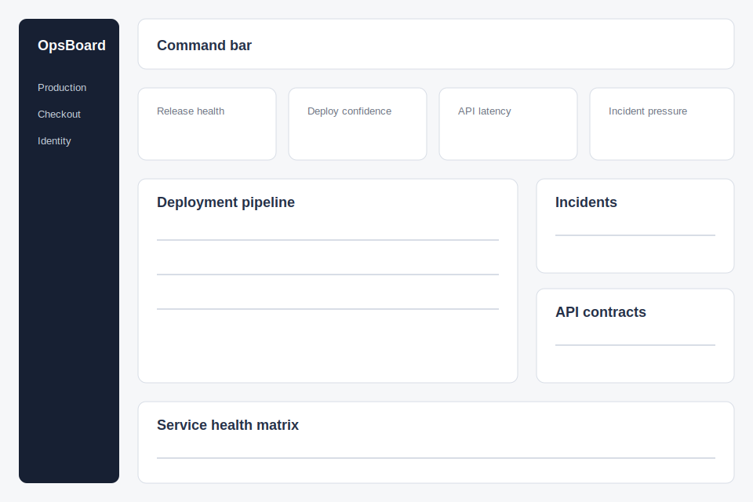

# UI Notes

The interface is an operational release dashboard. It should feel precise, tense, and work-focused, with compact panels, strong table scanning, and restrained but clear risk color.

## Design Asset

## Layout

- Left navigation rail with environment and service shortcuts.
- Top command bar with search, filter, and deploy window controls.
- KPI strip for release health, deploy confidence, API latency, and incident pressure.
- Main grid with deployment pipeline table, service health matrix, incident queue, and API contract panel.

## Components

- KPI tile with icon, label, value, trend, and status line.
- Deployment table with status pills and next action labels.
- Incident list with severity, owner, service, and age.
- Service health matrix with compact rows and latency indicators.
- API contract panel showing endpoint readiness and schema status.

## States

- Healthy: green status, check icon, calm copy.
- Warning: amber status, clock or activity icon.
- Blocked: red status, action required label.
- In progress: blue status, active pulse marker.

## Responsive Behavior

- Desktop: two-column work surface with table as the largest region.
- Tablet: stack secondary panels below the deployment table.
- Mobile future: table should become grouped cards, but this example optimizes for tablet and desktop.
